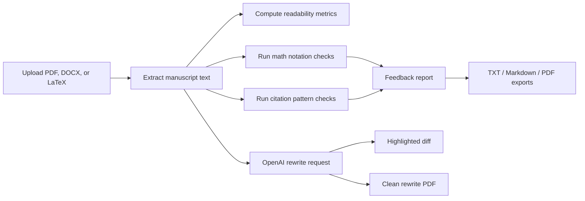

# ScholarFix / RedPen MVP
## AI-assisted academic manuscript feedback, rewriting, and export tooling

ScholarFix is a Streamlit MVP for reviewing academic manuscripts. It accepts
PDF, DOCX, and LaTeX uploads, extracts text, runs lightweight citation and math
notation checks, generates OpenAI-assisted rewrites, and exports feedback as
plain text, Markdown, or PDF.

The project is intentionally positioned as an academic writing assistant, not an
automated referee. Its deterministic checks are heuristics, and its AI output
should be reviewed by the author before use in any submission.


## What The App Does

| Area | Current capability | Output |
| --- | --- | --- |
| Document ingestion | Reads `.pdf`, `.docx`, and `.tex` uploads | Extracted manuscript text preview |
| Math review | Flags detected notation and prompts users to verify definitions | Math findings panel and reports |
| Citation review | Detects numeric, LaTeX, and APA-style citation patterns | Citation findings panel and reports |
| AI rewrite | Rewrites an excerpt using configurable section, tone, and level | Markdown rewrite and clean PDF draft |
| Difference view | Shows token-level insertions and deletions | Inline highlighted HTML diff |
| Reporting | Builds feedback reports | TXT, Markdown, and branded PDF exports |

## Why This Project Matters

Academic writing tools often stop at grammar correction. Research manuscripts
also need citation consistency, clear mathematical notation, reviewer-style
feedback, and exportable notes that authors can act on. ScholarFix brings those
steps into one local workflow.

The useful parts for a reviewer or employer are the separation between
deterministic checks and AI generation, support for multiple manuscript formats,
and a reproducible Streamlit app structure that can be extended into a larger
review platform.

## Workflow



## Repository Structure

```text
redpen_mvp/
├── app.py                         # Canonical Streamlit app
├── auth.py                        # Firebase token verification helper
├── config.py                      # Central environment and path config
├── signin_component.py            # Firebase sign-in HTML wrapper
├── assets/
│   ├── logo.png
│   └── style.css
├── components/
│   └── signin_component.html
├── feedback/
│   ├── ai_suggestions.py
│   ├── citation_checker.py
│   └── math_checker.py
├── parsers/
│   ├── docx_parser.py
│   ├── pdf_parser.py
│   └── tex_parser.py
├── reports/
│   ├── pdf_generator.py
│   └── report_generator.py
├── scripts/
│   └── benchmark.py
├── utils/
│   ├── diff_utils.py
│   └── text_metrics.py
├── tests/
├── archive/                       # Legacy prototype and placeholders
├── requirements.txt
├── pyproject.toml
└── .env.example
```

## Quick Start

```powershell
python -m venv .venv
.venv\Scripts\activate
pip install -r requirements.txt
copy .env.example .env
streamlit run app.py
```

Add your OpenAI API key to `.env`:

```text
OPENAI_API_KEY=your_key_here
REDPEN_DEV_MODE=true
```

For local development, `REDPEN_DEV_MODE=true` bypasses Firebase sign-in. Set
`REDPEN_DEV_MODE=false` only when Firebase Admin credentials are configured.

## Reproducible Workflow

1. Install dependencies from `requirements.txt`.
2. Create `.env` from `.env.example`.
3. Run `streamlit run app.py` from the project root.
4. Upload a PDF, DOCX, or LaTeX manuscript.
5. Review extracted text, readability metrics, math findings, and citation findings.
6. Optionally generate an AI rewrite.
7. Export TXT, Markdown, or PDF feedback reports.

## Outputs For Users

| UI section | User-facing purpose | Files generated on download |
| --- | --- | --- |
| Analysis | Inspect extracted text and deterministic findings | None until exported |
| Rewrite | Compare original text with the AI rewrite | `scholarfix_rewrite.md`, `scholarfix_rewritten_draft.pdf` |
| Reports | Export feedback and optional rewrite context | `scholarfix_feedback.txt`, `scholarfix_feedback.md`, `scholarfix_feedback_report.pdf` |

Generated reports are user artifacts, so they are ignored by default in
`.gitignore`. Do not commit private manuscripts, uploaded PDFs, `.env`, or
Firebase service-account JSON files.

## Current Interpretation Notes

- Math findings are notation prompts, not formal mathematical validation.
- Citation findings indicate detected citation styles and alignment checks to perform.
- Readability metrics are approximate and should be interpreted directionally.
- AI rewrites can improve prose but may still alter nuance; authors should review every change.
- The highlighted diff is token-level and meant for quick inspection, not legal redlining.

## Development Commands

```powershell
python -m pytest
python -m ruff check .
python scripts/benchmark.py
```

Ruff is configured as an optional development dependency in `pyproject.toml`.

## Security And Privacy

- `.env` and Firebase credential JSON files are ignored.
- The app sends manuscript excerpts to the configured OpenAI model when AI rewrite
  or summary features are used.
- `components/signin_component.html` uses placeholder Firebase web config values;
  update them only when deploying Firebase authentication.
- Avoid uploading confidential manuscripts unless the deployment environment and
  API usage policy are appropriate for that material.

## Limitations

- Citation and math checks are lightweight heuristics.
- PDF extraction quality depends on the source PDF structure.
- The app does not currently parse or validate a bibliography file.
- Firebase sign-in is present but should be reviewed before production deployment.
- The OpenAI rewrite is a drafting aid, not guaranteed scholarly correctness.

## Future Extensions

- BibTeX parsing and citation-key reconciliation.
- DOCX comments or tracked-change style exports.
- Section-aware manuscript parsing.
- Configurable reviewer personas and discipline-specific checklists.
- Batch processing for multiple manuscripts.
- Deployment hardening with Streamlit secrets and Firebase domain restrictions.
- A small screenshot gallery once the UI stabilizes.

## Author

Dr. Muhammad Shoaib
