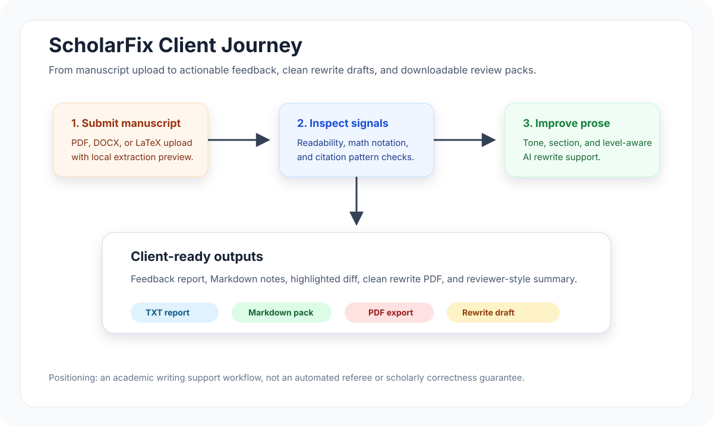
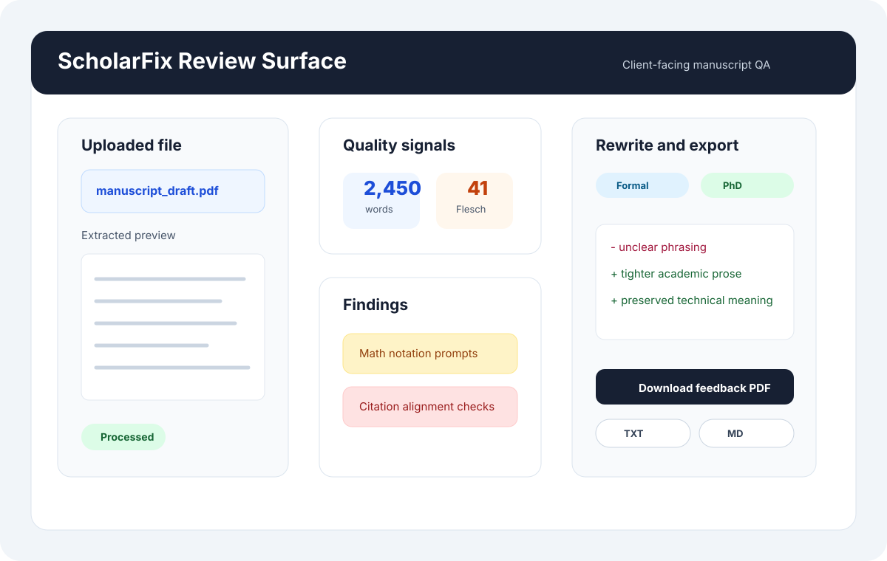
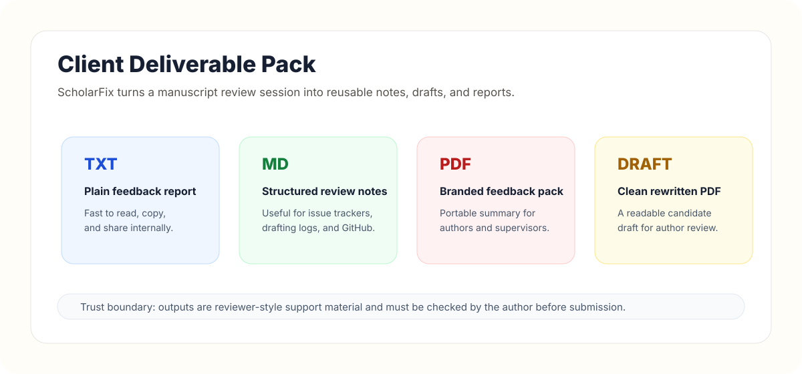
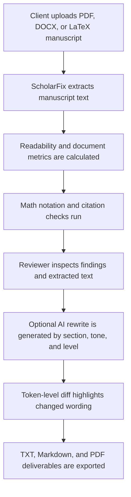

# ScholarFix / RedPen MVP
## Client-facing academic manuscript review, rewrite, and export assistant

[](https://www.python.org/)
[](LICENSE)
[](tests/)
[](https://streamlit.io/)

ScholarFix is a Streamlit MVP for academic authors, editors, research groups, and education teams
that need a fast, explainable way to review draft manuscripts before submission. It accepts PDF,
DOCX, and LaTeX uploads, extracts manuscript text, checks readability, highlights citation and math
notation signals, supports AI-assisted rewriting, and exports client-ready feedback packs.

The product is intentionally positioned as a **writing support and review workflow**, not an
automated referee, proof of correctness, or substitute for academic judgment. Deterministic checks
surface issues to review; AI rewrites are drafting aids that authors should verify before use.


## Client Value

ScholarFix helps turn a manuscript review session into an actionable deliverable:

- A clear upload-to-feedback workflow for PDF, DOCX, and LaTeX drafts.
- Readability and structure signals that help authors see where prose may be difficult to follow.
- Lightweight citation-pattern checks for numeric, LaTeX, and APA-style references.
- Math-notation prompts that encourage authors to define symbols near first use.
- Configurable rewrite support by section, academic level, and tone.
- Highlighted before/after diff for quick author review.
- TXT, Markdown, and PDF exports that can be shared with authors, supervisors, or editing clients.

## Visual Overview







## What Clients Can Use It For

| Client need | How ScholarFix helps | Practical output |
| --- | --- | --- |
| First-pass manuscript triage | Extracts text and runs basic checks in one place | Review dashboard and feedback report |
| Academic editing support | Generates rewrite suggestions with tone and level controls | Markdown rewrite and clean PDF draft |
| Research-group internal review | Creates consistent notes for recurring manuscript checks | Downloadable TXT, Markdown, and PDF reports |
| Student writing support | Makes readability, citations, and notation issues visible | Plain-English observations and action prompts |
| Product or consulting demo | Shows an end-to-end AI workflow with deterministic guardrails | Client-facing Streamlit MVP |

## Product Capabilities

| Area | Current capability | Client-facing value |
| --- | --- | --- |
| Document ingestion | Reads `.pdf`, `.docx`, and `.tex` uploads | Supports common academic drafting formats |
| Text extraction | Shows extracted manuscript preview | Lets reviewers verify the source text before analysis |
| Readability metrics | Word count, sentence count, average sentence length, Flesch label | Helps authors spot prose density and clarity risks |
| Math review | Detects mathematical notation and prompts definition checks | Encourages clearer variable and equation exposition |
| Citation review | Detects numeric, LaTeX, and APA-style citation patterns | Flags reference-alignment checks before submission |
| AI rewrite | Uses configurable section, tone, level, and model settings | Produces a candidate rewrite while preserving meaning |
| Difference view | Shows token-level insertions and deletions | Makes AI changes auditable for authors |
| Reporting | Builds feedback reports and branded PDFs | Converts review work into client-ready artifacts |
| Authentication | Firebase token helper plus local dev bypass | Gives a path toward controlled deployment |

## Workflow



## Example Review Session

1. A client uploads a draft article, thesis chapter, or technical note.
2. ScholarFix extracts text and shows a preview so the reviewer can confirm the upload parsed correctly.
3. The analysis tab summarizes length and readability, then lists math and citation observations.
4. The rewrite tab lets the reviewer choose a target section, tone, academic level, and rewrite depth.
5. The app generates a rewrite, shows a highlighted diff, and keeps the original excerpt visible.
6. The reports tab exports feedback in plain text, Markdown, or PDF, optionally including the rewrite.

## Client Deliverables

| Deliverable | File name | Best use |
| --- | --- | --- |
| Plain-text feedback | `scholarfix_feedback.txt` | Quick review notes and internal handover |
| Markdown report | `scholarfix_feedback.md` | GitHub issues, Notion pages, writing logs, or versioned review notes |
| Feedback PDF | `scholarfix_feedback_report.pdf` | Client-facing summary with math, citation, and rewrite context |
| Rewrite Markdown | `scholarfix_rewrite.md` | Editable rewrite draft for further author revision |
| Clean rewrite PDF | `scholarfix_rewritten_draft.pdf` | Portable candidate prose draft for review |

Generated reports are user artifacts and are ignored by default in `.gitignore`. Do not commit
private manuscripts, uploaded PDFs, `.env`, Firebase credential JSON files, or generated client
deliverables.

## Trust Boundary

ScholarFix is designed to make academic review work more consistent and more inspectable. It does
not guarantee that a manuscript is correct, novel, publishable, or citation-complete.

| Component | What it does | What it does not do |
| --- | --- | --- |
| Citation checker | Detects common citation patterns | Validate a full bibliography or reference list |
| Math checker | Prompts users to verify notation definitions | Prove mathematical correctness |
| Readability metrics | Provide directional prose indicators | Replace expert editing judgment |
| AI rewrite | Suggest clearer academic wording | Guarantee factual or disciplinary accuracy |
| PDF export | Packages findings for review | Certify readiness for journal submission |

## Technical Architecture

The app uses a `src`-style support structure around a canonical Streamlit entry point.

```text
redpen_mvp/
|-- app.py                         # Canonical Streamlit app
|-- auth.py                        # Firebase token verification helper
|-- config.py                      # Central environment and path config
|-- signin_component.py            # Firebase sign-in HTML wrapper
|-- assets/
|   |-- logo.png
|   |-- style.css
|   |-- readme_client_journey.svg
|   |-- readme_review_surface.svg
|   `-- readme_export_pack.svg
|-- components/
|   `-- signin_component.html
|-- feedback/
|   |-- ai_suggestions.py          # OpenAI-backed rewrite helper
|   |-- citation_checker.py        # Citation-pattern checks
|   `-- math_checker.py            # Math-notation prompts
|-- parsers/
|   |-- docx_parser.py
|   |-- pdf_parser.py
|   `-- tex_parser.py
|-- reports/
|   |-- pdf_generator.py
|   `-- report_generator.py
|-- scripts/
|   `-- benchmark.py
|-- utils/
|   |-- diff_utils.py
|   `-- text_metrics.py
|-- tests/
|-- archive/                       # Legacy prototype and placeholders
|-- requirements.txt
|-- pyproject.toml
`-- .env.example
```

## Implementation Highlights

| Layer | Implementation detail |
| --- | --- |
| Frontend | Streamlit app with tabs for Analysis, Rewrite, and Reports |
| Parsing | PyMuPDF for PDFs, `python-docx` for DOCX, `pylatexenc` for LaTeX |
| Rewrite | OpenAI chat completion helper with model configured through environment |
| Reporting | Plain text, Markdown, and ReportLab PDF generation |
| Diff view | Token-level HTML diff with escaped content for safer rendering |
| Config | `.env` support with local development bypass for Firebase |
| Testing | Pytest coverage for metrics, feedback checks, reports, config, parsers, and PDF smoke paths |

## Quick Start

```powershell
python -m venv .venv
.venv\Scripts\activate
pip install -r requirements.txt
copy .env.example .env
streamlit run app.py
```

Add your OpenAI API key to `.env` if you want rewrite and summary features:

```text
OPENAI_API_KEY=your_key_here
REDPEN_DEV_MODE=true
```

For local development, `REDPEN_DEV_MODE=true` bypasses Firebase sign-in. Set
`REDPEN_DEV_MODE=false` only when Firebase Admin credentials are configured.

## Reproducible Local Workflow

1. Install dependencies from `requirements.txt`.
2. Create `.env` from `.env.example`.
3. Run `streamlit run app.py` from the project root.
4. Upload a PDF, DOCX, or LaTeX manuscript.
5. Review extracted text, readability metrics, math findings, and citation findings.
6. Optionally generate an AI rewrite.
7. Export TXT, Markdown, or PDF feedback reports.

## Development Commands

```powershell
python -m pytest
python -m ruff check .
python scripts/benchmark.py
```

Ruff and pytest are configured as optional development dependencies in `pyproject.toml`.

## Security And Privacy

- `.env` and Firebase credential JSON files are ignored.
- The app sends manuscript excerpts to the configured OpenAI model when rewrite or summary features are used.
- Deterministic checks run locally over extracted text.
- `components/signin_component.html` contains placeholder Firebase web config values.
- Avoid uploading confidential manuscripts unless the deployment environment, data handling process, and API usage policy are appropriate for that material.
- For production deployment, use Streamlit secrets or equivalent secret management, not local JSON credentials.

## Current Limitations

- Citation and math checks are lightweight heuristics.
- PDF extraction quality depends on the source PDF structure.
- The app does not currently parse or validate a bibliography file.
- Firebase sign-in is present but should be reviewed before production deployment.
- AI rewrites can alter nuance and must be reviewed by the author.
- The app is not yet a tracked-change DOCX editor or journal-specific compliance checker.

## Future Extensions

- BibTeX parsing and citation-key reconciliation.
- DOCX comments or tracked-change style exports.
- Section-aware manuscript parsing for abstract, introduction, methods, results, and conclusion.
- Configurable reviewer personas and discipline-specific checklists.
- Batch processing for multiple manuscripts.
- Deployment hardening with Streamlit secrets and Firebase domain restrictions.
- Screenshot gallery from a stabilized hosted deployment.
- Client workspace model for storing review history and export packs.

## Professional Relevance

ScholarFix demonstrates an end-to-end AI product pattern that clients often ask for:

- Multi-format document ingestion.
- Deterministic quality checks alongside AI generation.
- Human-reviewable diffs rather than opaque rewrites.
- Exportable client deliverables.
- Privacy-aware configuration and secret handling.
- Testable Python modules behind a simple Streamlit product surface.

## Citation

If this repository is useful in research, review, or portfolio evaluation, cite the metadata in
`CITATION.cff`.

## Author

**Dr. Muhammad Shoaib**<br>
GitHub: [@drmshoaib](https://github.com/drmshoaib)
